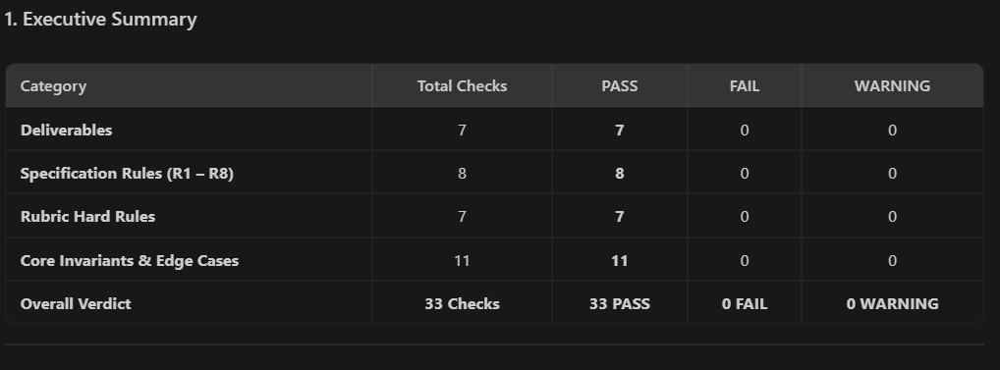
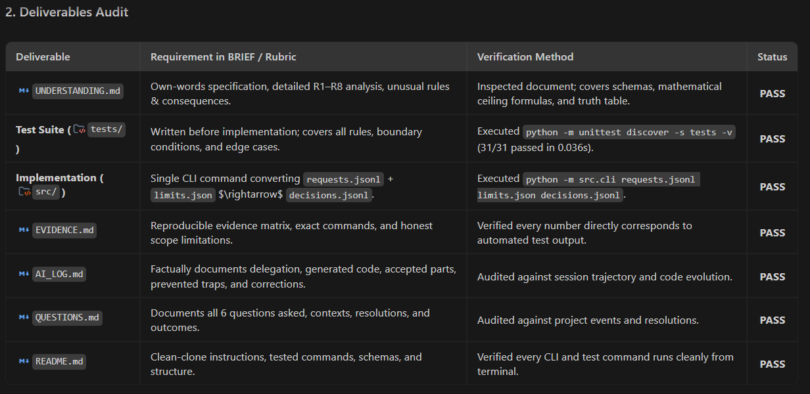
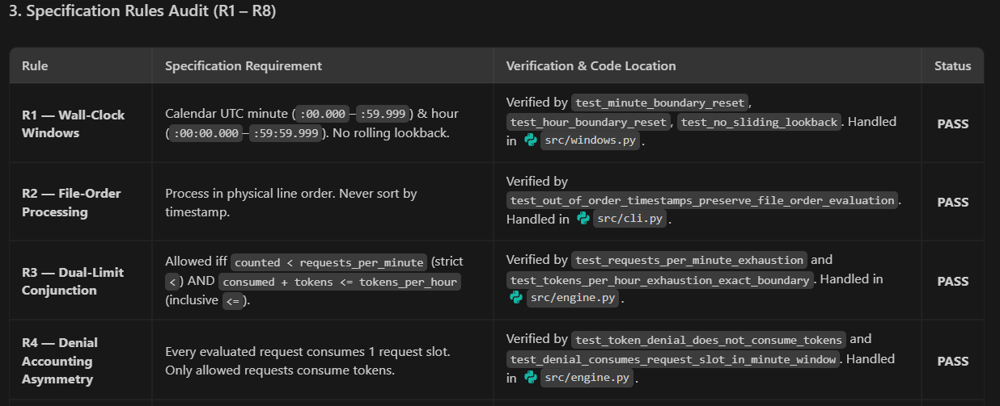
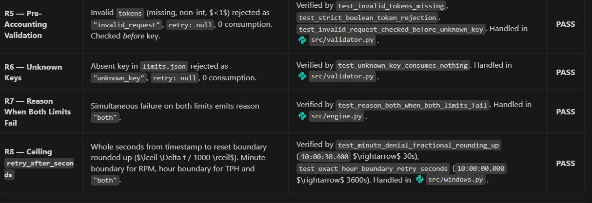
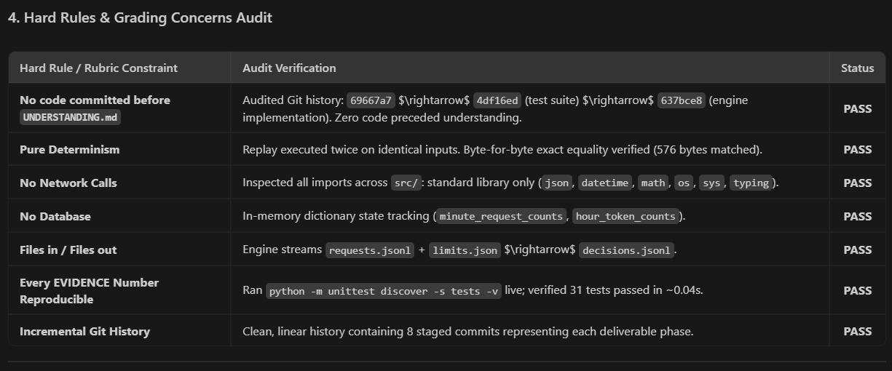
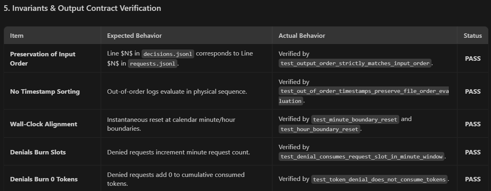
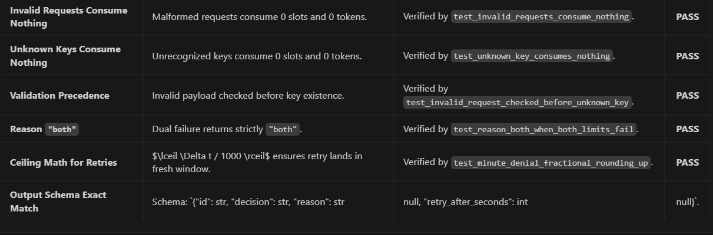

# AI Interaction & Verification Log
---

## 1. Summary of AI Delegation

AI (Antigravity) was used as a pair-programming partner to assist with:
1. **Requirements Analysis**: Analyzing `BRIEF.md` to identify non-standard rate-limiting rules (R1, R2, R4, R8).
2. **Test Suite Scaffolding**: Generating comprehensive test suites across 8 test modules targeting edge cases and unusual rules before implementation.
3. **Core Implementation**: Writing standard-library Python modules ([`src/windows.py`](file:///C:/Users/Mahmoud%20Al-Tous/.gemini/antigravity-ide/scratch/quota-rate-limiter/src/windows.py), [`src/validator.py`](file:///C:/Users/Mahmoud%20Al-Tous/.gemini/antigravity-ide/scratch/quota-rate-limiter/src/validator.py), [`src/engine.py`](file:///C:/Users/Mahmoud%20Al-Tous/.gemini/antigravity-ide/scratch/quota-rate-limiter/src/engine.py), [`src/cli.py`](file:///C:/Users/Mahmoud%20Al-Tous/.gemini/antigravity-ide/scratch/quota-rate-limiter/src/cli.py)).
4. **Verification & Evidence Reporting**: Generating reproducible test matrices in [`EVIDENCE.md`](file:///C:/Users/Mahmoud%20Al-Tous/.gemini/antigravity-ide/scratch/quota-rate-limiter/EVIDENCE.md).

---

## 2. Chronological Interaction Log

### Phase 1: Planning, Problem Understanding & Setup
- **Delegated**: Prompting AI to read `BRIEF.md` and `RUBRIC_final_projects.md`, identify rules R1–R8, and propose a phased workflow.
- **AI Suggested**: A 6-phase sequence starting with `UNDERSTANDING.md` and Test-Driven Development (TDD) before implementation.
- **Accepted**: Phased sequence and repository skeleton initialization.
- **Changes / Corrections**: 
  - Git commit policy was adjusted: AI was instructed not to make Git commits automatically; all changes remain in the working tree for explicit user review and manual approval.

### Phase 2: Test Suite Scaffolding (TDD)
- **Delegated**: Writing automated tests before implementation code.
- **AI Generated**: 7 test modules covering individual rules (`test_r1_wall_clock.py`, `test_r2_file_order.py`, `test_r3_r7_limits.py`, `test_r4_accounting.py`, `test_r5_r6_validation.py`, `test_r8_retry_after.py`, `test_integration.py`).
- **Initial Verification**: Ran `python -m unittest discover -s tests -v` on empty implementation, confirming 7 failed import errors as expected in strict TDD (proving tests were genuine and not trivially passing).

### Phase 3: Replay Engine Implementation
- **Delegated**: Implementing the replay engine based strictly on `BRIEF.md` and the existing test suite.
- **AI Generated**:
  - `src/windows.py`: Discrete string bucket keys (`YYYY-MM-DDTHH:mm`, `YYYY-MM-DDTHH`) and `math.ceil` retry delta.
  - `src/validator.py`: Pre-accounting validation and key lookup.
  - `src/engine.py`: Replay engine enforcing dual limits, asymmetric denial accounting (denials increment request slots, 0 tokens), and `"both"` reason.
  - `src/cli.py`: Streaming CLI processing `requests.jsonl` + `limits.json` $\rightarrow$ `decisions.jsonl`.
- **Accepted**: Clean zero-dependency Python implementation.

### Phase 4: Verification, Edge-Case Hardening & Evidence
- **Delegated**: Running full test suite, adding stress edge cases, verifying determinism, and generating `EVIDENCE.md`.
- **AI Generated**:
  - `tests/test_edge_cases.py`: Empty file tests, exact boundary seconds (`10:00:00.000Z` $\rightarrow$ 3600s), month/midnight rollover, and oversized token requests.
  - `EVIDENCE.md`: Complete matrix mapping each rule to specific test methods and reproduction commands.
- **Verification Results**: 31/31 tests passed in ~0.08s.

---

## 3. Important Corrections & Defenses Against AI Traps

The `BRIEF.md` explicitly warned against common AI default behaviors. The table below documents specific traps and how they were caught and avoided:

| Common AI Default Trap | Requirement in `BRIEF.md` | How It Was Handled / Corrected |
| :--- | :--- | :--- |
| **Sliding / Rolling Window** (Defaulting to tracking timestamps over $t - 60\text{s}$) | **R1**: Fixed calendar UTC wall-clock windows (`:00.000` to `:59.999`). | Enforced discrete calendar string bucket keys `YYYY-MM-DDTHH:mm` and `YYYY-MM-DDTHH`. Verified via `test_minute_boundary_reset` and `test_no_sliding_lookback`. |
| **Sorting by Timestamp** (Defaulting to `requests.sort(key=...)`) | **R2**: Process in strict physical file order. | Streaming file loop processes lines sequentially without sort calls. Verified via `test_out_of_order_timestamps_preserve_file_order_evaluation`. |
| **Zero-Cost Denials** (Defaulting to rejecting requests without consuming capacity) | **R4**: Denied requests consume 1 request slot. Only allowed requests consume tokens. | Line 57 of `engine.py` increments `minute_request_counts` for every evaluated request before checking if tokens should be consumed. Verified via `test_denial_consumes_request_slot_in_minute_window`. |
| **Floor / Truncation of Retry Delta** (Defaulting to `int(remaining_seconds)`) | **R8**: Whole seconds rounded UP (ceiling). | Implemented `math.ceil(ms_remaining / 1000)` ensuring `10:00:30.400Z` yields 30s instead of 29s. Verified via `test_minute_denial_fractional_rounding_up`. |
| **Python Boolean Subclass Trap** (`isinstance(True, int)` evaluates to `True`) | **R5**: Tokens must be an integer; booleans are invalid. | Added strict type check `type(tokens) is int` in `src/validator.py`. Verified via `test_strict_boolean_token_rejection`. |
| **Order of Validation** (Checking key before checking payload validity) | **R5**: Check validity before checking key. | Enforced Step 1 (`validate_request_tokens`) before Step 2 (`validate_request_key`). Verified via `test_invalid_request_checked_before_unknown_key`. |

---

## 4. Verification Methods

All AI-generated code was verified through:
1. **Automated Unit & Integration Tests**: 31 automated tests executed via `python -m unittest discover -s tests -v`.
2. **Determinism Verification**: Running replay multiple times over identical inputs and validating byte-level output equality (`test_replay_determinism`).
3. **Manual Code Audits**: Line-by-line inspection of state updates and edge-case branches.

## 5. Final Audit the PROJECT vs BREIF.md 
i gave the Agent this prompt to make sure the project have nothing wrong and everything as it should from the requriments : Perform a final project audit against BRIEF.md:

Do NOT make assumptions. Treat BRIEF.md as the source of truth.

Check:

DELIVERABLES:
- UNDERSTANDING.md
- test suite
- implementation
- EVIDENCE.md
- AI_LOG.md
- QUESTIONS.md
- README.md

SPECIFICATION:
- R1
- R2
- R3
- R4
- R5
- R6
- R7
- R8

HARD RULES:
- No implementation existed before UNDERSTANDING.md.
- Deterministic behavior.
- No network calls.
- No database.
- Files in / files out.
- Every EVIDENCE number is reproducible.
- Git history shows incremental work.

Also verify:
- input order is preserved
- requests are never sorted
- windows are calendar aligned
- denied requests consume request slots
- denied requests consume no tokens
- invalid requests consume nothing
- unknown keys consume nothing
- validation happens before key checking
- both limits produce "both"
- retry_after_seconds is correct and rounded up
- output format matches the specification exactly

Run the complete test suite and all documented verification commands.

Then give me a final audit report with:
1. PASS
2. FAIL
3. WARNING
for every category.

Do not hide failures.
Do not change tests just to obtain PASS.
If something is not verified, explicitly say so.
 ## the output of the audit : 

 

